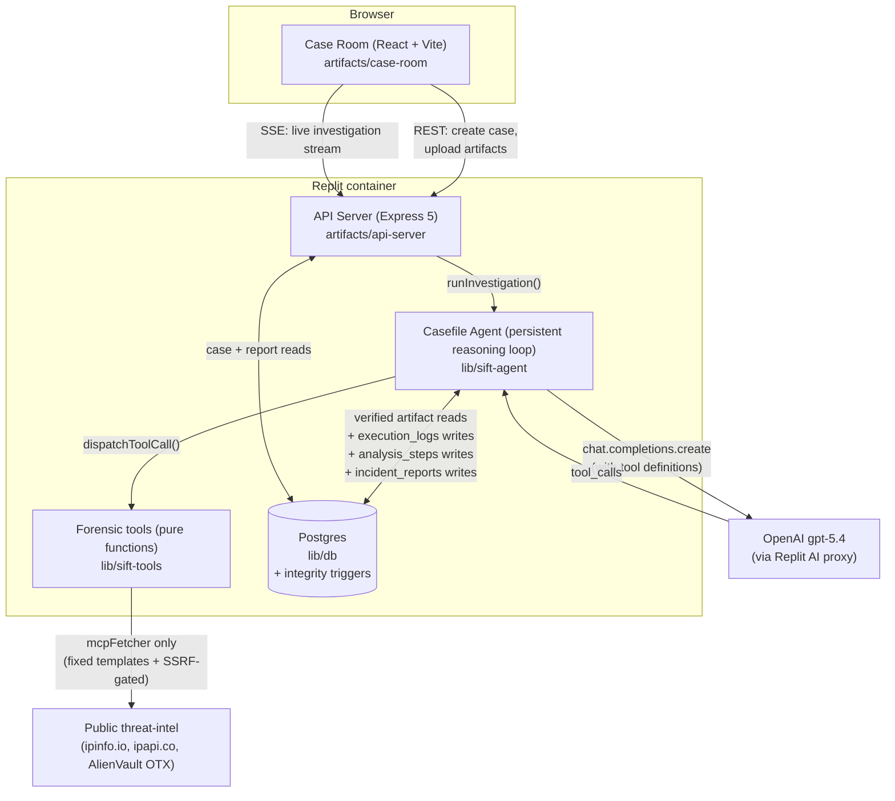
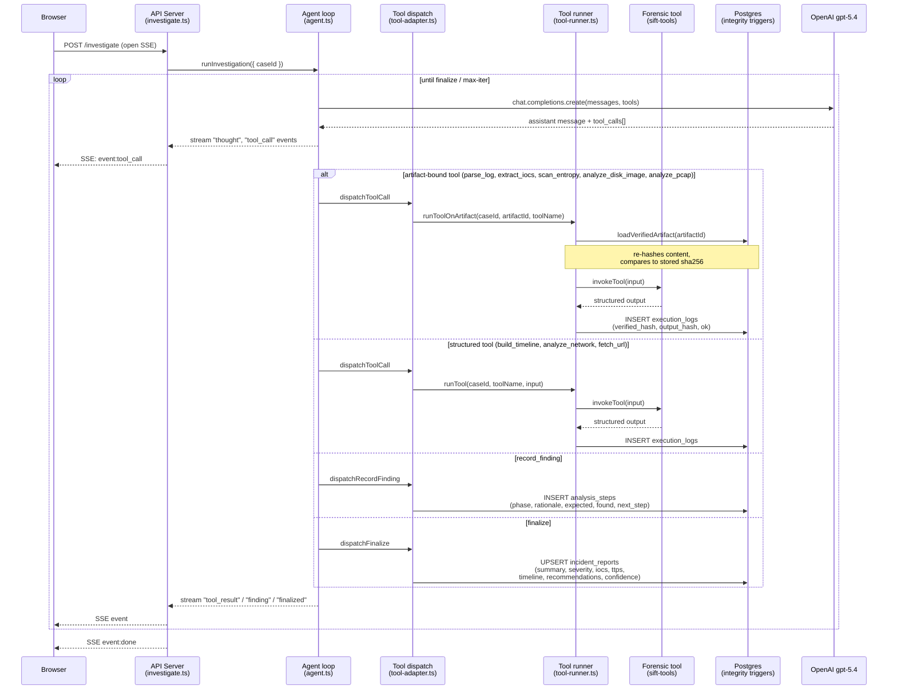

# Casefile — Architecture

Casefile is an autonomous incident-response agent. A human uploads
evidence (logs, network captures, disk images, suspicious files) into a
case folder and the system investigates end-to-end: forms hypotheses,
runs forensic tools, records findings as it goes, and produces a final
incident report with a verifiable chain of custody.

This document is the architecture map a judge or new contributor should
read first. It covers the architectural pattern, the request path, the
guardrail model (prompt-based vs. architectural), the evidence-integrity
layers, and the file:function landmarks for every meaningful step.

A standalone, uploadable rendering of the system diagram lives at
[`architecture-diagram.svg`](architecture-diagram.svg).

## Architectural pattern: Direct Agent Extension

Casefile is a **single agent built directly on the model's native
tool-calling**, driven in a persistent reasoning loop. It is not a
multi-agent system, not an MCP-server integration, and not a wrapper
around an agentic IDE. The loop in `lib/sift-agent/src/agent.ts` calls
`chat.completions.create` with a fixed tool catalog, dispatches the
returned `tool_calls`, appends the results to the running message
history, and repeats until the model voluntarily calls `finalize` or a
bounded iteration limit trips.

Naming caveat (kept honest for the judges): the network-fetch tool is
called `mcpFetcher` and one artifact kind is `mcp_endpoint`, but Casefile
does **not** speak the Model Context Protocol. Those names are internal
labels that predate the final design; there is no external MCP server in
the loop.

## System overview



## Request path: `POST /api/cases/:id/investigate`

This is the single hot path the agent exercises during a case. Every
file and function below is the actual landing place, not a sketch.



### File:function landmarks

| Step | File | Function |
| --- | --- | --- |
| HTTP entry + SSE writer | `artifacts/api-server/src/routes/investigate.ts` | `router.post("/cases/:caseId/investigate")` |
| Agent loop driver | `lib/sift-agent/src/agent.ts` | `runInvestigation` |
| LLM tool-call dispatch | `lib/sift-agent/src/tool-adapter.ts` | `dispatchToolCall` |
| `fetch_url` template resolution | `lib/sift-agent/src/tool-adapter.ts` | endpoint-template table (server-side URL build) |
| Artifact tool wrapper | `lib/sift-agent/src/tool-runner.ts` | `runToolOnArtifact` |
| Structured tool wrapper | `lib/sift-agent/src/tool-runner.ts` | `runTool` |
| Forensic tool table | `lib/sift-tools/src/index.ts` | `invokeTool` / `TOOL_REGISTRY` |
| Hash re-verification | `lib/db/src/integrity.ts` | `loadVerifiedArtifact` |
| Finding write | `lib/sift-agent/src/tool-adapter.ts` | `dispatchRecordFinding` |
| Final report write | `lib/sift-agent/src/tool-adapter.ts` | `dispatchFinalize` |
| Immutability triggers | `lib/db/src/triggers.sql` | `sift_reject_artifact_mutation` |

## Guardrails: prompt-based vs. architectural

The brief asks for an agent whose conclusions can be *trusted*. Casefile
draws a hard line between two kinds of control, because they offer very
different guarantees.

**Prompt-based guardrails** are instructions in the system prompt. They
shape behavior but a misaligned or jailbroken model could in principle
ignore them:

- "Never claim a fact about evidence without a tool-verified
  observation to back it up."
- The four-beat investigation cycle (triage → deep analysis →
  synthesis → self-correction).
- "If external enrichment contradicts your hypothesis, surface the
  contradiction; do not silently drop it."
- Conclusions must be strictly evidence-based (e.g., the insider-threat
  case is engineered so the policy-violation reading is only defensible
  from what the artifacts actually show).
- `finalize` must commit to a severity level and a numeric confidence.

**Architectural guardrails** are enforced by code, the database, or the
runtime. The agent cannot bypass them regardless of what it "decides":

- **Storage immutability** — Postgres `BEFORE UPDATE`/`BEFORE DELETE`
  triggers on `case_artifacts` reject any mutation of evidence content
  or its stored hash.
- **Read-time verification** — `loadVerifiedArtifact` re-hashes the
  bytes on every read; a mismatch raises `ArtifactIntegrityError`,
  emits a `SPOLIATION` event, and halts the run.
- **Tamper-evident audit trail** — every `execution_logs` row persists
  the `verified_hash` of the artifact read and the `output_hash`
  returned to the model.
- **Typed tool allow-list** — the agent has only the typed forensic
  functions in the registry. There is no shell tool, no file-write
  tool, no arbitrary-code tool, and no DB write path to evidence.
- **`fetch_url` cannot construct arbitrary URLs** — the model supplies
  an *endpoint name* and an *IOC value*; the actual URL is built
  server-side from a fixed template, and the IOC is validated against
  the endpoint's expected kind (e.g., an `ip` endpoint refuses anything
  that is not a well-formed IP). `mcpFetcher` then applies three SSRF
  layers plus a timeout/size cap.
- **Bounded loop** — the reasoning loop has an iteration limit, so it
  cannot run unbounded.
- **Auth + ownership** — every case endpoint is gated by Replit Auth and
  a per-case ownership check.

### What happens when the agent tries to bypass them

This is the property the brief actually cares about, so it is worth
spelling out:

- *Tries to alter or delete evidence:* no tool exists to do so, and even
  a direct DB write is rejected by the triggers. Nothing changes.
- *Evidence is altered out-of-band:* the next `loadVerifiedArtifact`
  recomputes the hash, detects the mismatch, emits `SPOLIATION`, and
  stops — the agent never reasons over tampered bytes.
- *Tries to reach an internal or attacker-controlled URL via
  `fetch_url`:* the fixed-template + IOC-kind + SSRF layers reject it; a
  free-form URL is not even expressible through the tool surface.
- *Fabricates a finding with no supporting observation:* the finding is
  still written (prose grounding is prompt-based, not enforced), **but**
  every tool read is independently logged with hashes, so the
  chain-of-custody view exposes that no supporting observation exists.
  The architectural controls protect the *evidence* and the *audit
  trail*; they make an unsupported claim visible rather than silently
  preventing the model from writing prose.

## Evidence-integrity model

```mermaid
flowchart LR
    subgraph L1["Layer 1 — storage immutability<br/>(Postgres triggers)"]
        T1["sift_artifact_immutable<br/>(BEFORE UPDATE)"]
        T2["sift_artifact_no_direct_delete<br/>(BEFORE DELETE)"]
    end

    subgraph L2["Layer 2 — read-time verification<br/>(per tool call)"]
        H1["loadVerifiedArtifact()<br/>re-hashes on every read"]
        H2["execution_logs.verified_hash<br/>(what we actually saw)"]
        H3["execution_logs.output_hash<br/>(what we returned to the LLM)"]
    end

    subgraph L3["Layer 3 — reasoning provenance<br/>(per finding)"]
        S1["analysis_steps row per finding<br/>(phase, rationale, expected, found)"]
        S2["incident_reports.confidence + severity<br/>(agent must commit a number)"]
    end

    Upload["POST /artifacts<br/>SHA-256 at write"] --> L1
    L1 --> L2
    L2 --> L3
    L3 --> Report["Final report shown to user<br/>+ chain-of-custody view"]
```



**Layer 1 — Storage immutability.** Two `BEFORE` triggers on
`case_artifacts` (see `lib/db/src/triggers.sql`) reject any `UPDATE`
that touches evidence content or its stored hash, and reject any
direct `DELETE` that is not a cascade from `cases`. The agent cannot
tamper with the input it is reasoning about, even if the LLM tries to.

**Layer 2 — Read-time verification.** `loadVerifiedArtifact` re-hashes
the artifact bytes on every read and aborts the investigation with a
`SPOLIATION` event if the stored and recomputed hashes disagree. The
verified hash, and a hash of the tool's output, are both persisted to
`execution_logs` — so the chain-of-custody view can replay exactly what
the agent saw.

**Layer 3 — Reasoning provenance.** Every meaningful conclusion is
written as an `analysis_steps` row through the `record_finding` tool,
with a structured (phase, rationale, expected, found, next_step)
schema. The final `incident_reports` row commits to a numeric
confidence and a 5-level severity enum, so the agent cannot hedge its
way out of being judged.

## Forensic tool catalog

All tools live in `lib/sift-tools/src/` and follow the same
`ToolDescriptor<Input, Output>` shape: a Zod input schema, a Zod output
schema, and a pure `run()` function. They are a **self-built,
SIFT-style** suite — they are *not* the SANS SIFT Workstation, and the
name is an homage, not a dependency. Only `mcpFetcher` touches the
network; everything else is pure-local and reproducible.

| Tool | Purpose | Network? |
| --- | --- | --- |
| `logParser` | Parses syslog / auth.log / Sysmon / generic event lines into structured rows | no |
| `iocExtractor` | Sweeps text for IPs, domains (incl. IDN/homoglyph via `suspiciousDomains`), URLs, emails, hashes, CVEs, file paths | no |
| `entropyScanner` | Shannon entropy of an artifact — flags encrypted/packed payloads | no |
| `timelineBuilder` | Sorts events chronologically, detects bursts and gaps | no |
| `networkAnalyzer` | Summarises a connection list, flags suspicious ports / unique IPs / beaconing | no |
| `pcapAnalyzer` | Parses packet-capture summaries — flags periodic C2 beacons, jitter, byte volume | no |
| `diskImageAnalyzer` | Pure-Node MBR/GPT parser, filesystem-signature detector, printable-string + embedded-indicator harvester (over decoded bytes) | no |
| `mcpFetcher` | Fetches a public HTTP(S) threat-intel URL, built from a fixed server-side template | **yes** |

The agent exposes eleven tool names to the model: the eight forensic
tools above plus `list_artifacts`, `record_finding`, and `finalize`.

`mcpFetcher` is defended against SSRF at three levels: literal host
checks (blocks loopback / RFC1918 / link-local / ULA / CGNAT, including
decimal-encoded and hex-encoded IPv4 and IPv6 forms), DNS resolution
checks (refuses any name that resolves to a private / loopback / CGNAT /
multicast address), and a 10s timeout plus ~500 KB response cap. It is
only ever reached through the fixed-template `fetch_url` adapter, so the
model never hands it a raw URL.

## Package layout

```
artifacts/
  api-server/        Express 5 HTTP + SSE entry point (REST contract in lib/api-spec)
  case-room/         React + Vite UI — live investigation timeline, evidence locker,
                     chain-of-custody view, IR report renderer
  mockup-sandbox/    Internal-only design preview environment (not shipped)

lib/
  api-spec/          OpenAPI source of truth (openapi.yaml) + orval codegen
  api-zod/           Generated Zod request/response schemas (do not hand-edit)
  api-client-react/  Generated React Query hooks for the frontend
  db/                Drizzle schema, integrity triggers, hash-verification helpers
  sift-tools/        The forensic-tool catalog (pure, no DB, no network except mcpFetcher)
  sift-agent/        The reasoning loop, OpenAI tool-call adapter, system prompt
```

The agent depends on `sift-tools` and `db`. The API server depends on
the agent and `db`. The UI depends on `api-client-react` and
`api-zod`. There are no cycles.

## Why this shape

- **Tools are pure and local.** A forensic finding has to be
  reproducible. Putting the tools in their own package with no DB and
  no network (except the one explicitly-network tool) means an
  evaluator can re-run `invokeTool` on the same bytes and get the same
  output, byte for byte.
- **Integrity lives in the database, not the application.** An
  application-layer immutability check can be bypassed by any
  contributor who writes a new code path. A trigger cannot.
- **The agent's reasoning is a first-class table.** `analysis_steps` is
  not a log — it is the chain of thought, structured. The UI renders
  it directly, and the accuracy report (`docs/accuracy-report.md`)
  scores against it.
- **Egress is one tool, one template, three SSRF layers.** Threat-intel
  enrichment is table-stakes for an IR agent, but it is also the single
  biggest blast radius. Concentrating all egress into one
  fixed-template, Zod-validated, SSRF-hardened function keeps the audit
  surface tiny.
